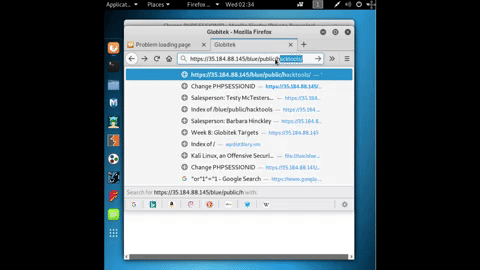
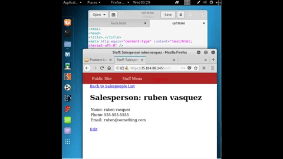

# Codepath-Week-8
# Project 8 - Pentesting Live Targets

Time spent: 7 hours spent in total

> Objective: Identify vulnerabilities in three different versions of the Globitek website: blue, green, and red.

The six possible exploits are:
* Username Enumeration
* Insecure Direct Object Reference (IDOR)
* SQL Injection (SQLi)
* Cross-Site Scripting (XSS)
* Cross-Site Request Forgery (CSRF)
* Session Hijacking/Fixation

Each version of the site has been given two of the six vulnerabilities. (In other words, all six of the exploits should be assignable to one of the sites.)

## Blue

Vulnerability #1:____SQL Injection______ 
Just a simple sql injection I found through the IDOR

Vulnerability #2: ___Session Hijacking/Fixation___
Changing the session in another incognito window

## Green

Vulnerability #1: ___Username Enumeration___
Found a way to detect usernames in the system. This is problematic due to the hacker having the ability to know the usernames associated with the site, and can therefore brute-force the site. 

Vulnerability #2: __Cross-Site Scripting (XSS)___
Simple xss on the contact page.

## Red

Vulnerability #1: __Insecure Direct Object Reference(IDOR)__
Easily found this.

Vulnerability #2: _ Cross-Site Request Forgery (CSRF)_
One of the most challenging out of all. Took me a few hours to get.

## Notes

Describe any challenges encountered while doing the work
The second vulnerability in the red took the longest to complete. 
