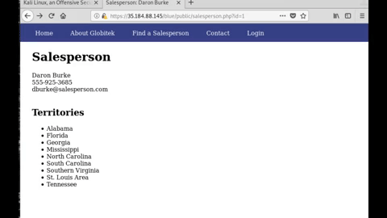
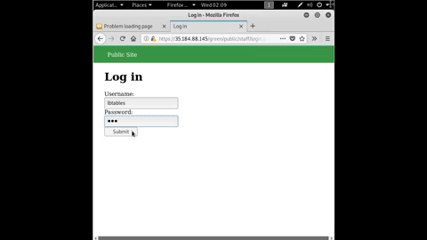
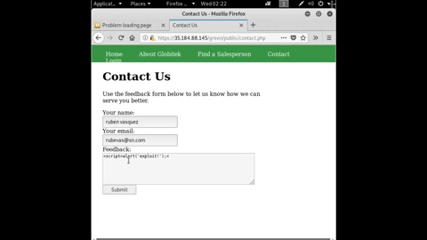
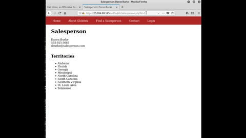

# Codepath-Week-8
# Project 8 - Pentesting Live Targets

Time spent: 7 hours spent in total

> Objective: Identify vulnerabilities in three different versions of the Globitek website: blue, green, and red.

The six possible exploits are:
* Username Enumeration
* Insecure Direct Object Reference (IDOR)
* SQL Injection (SQLi)
* Cross-Site Scripting (XSS)
* Cross-Site Request Forgery (CSRF)
* Session Hijacking/Fixation

Each version of the site has been given two of the six vulnerabilities. (In other words, all six of the exploits should be assignable to one of the sites.)

## Blue

Vulnerability #1:____SQL Injection______ 

Vulnerability #2: __________________

## Green

Vulnerability #1: __________________

Vulnerability #2: __________________

## Red

Vulnerability #1: __Insecure Direct Object Reference(IDOR)__

Vulnerability #2: __________________

## Notes

Describe any challenges encountered while doing the work
